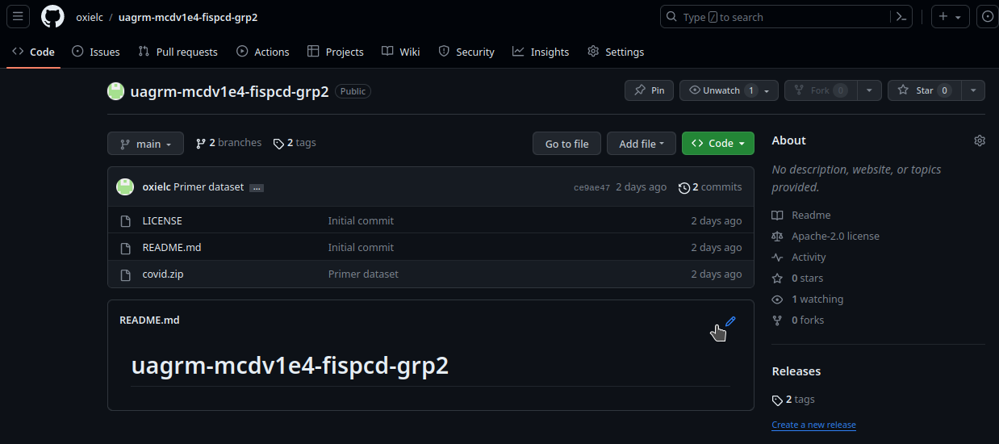
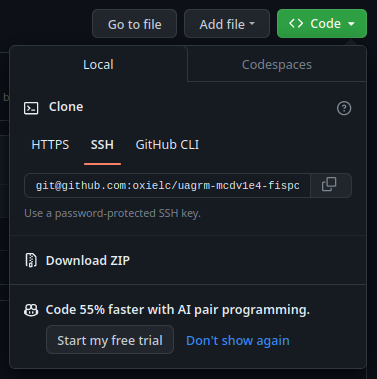
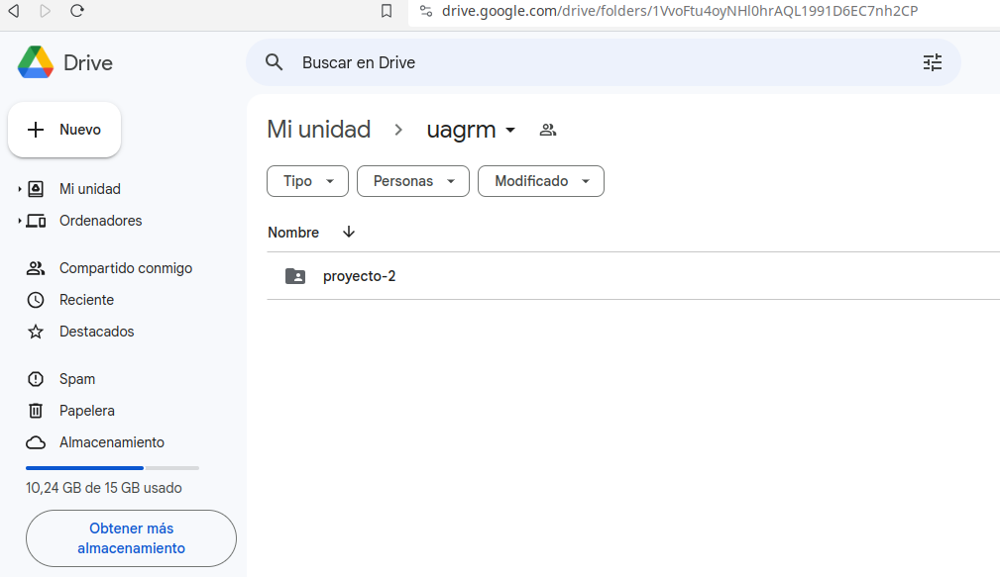

# Configuraciones y adecuación de ambientes de desarrollo
---
## Servicios públicos en Internet.
---
### I. Configuración de GitHub.

1. En el sitio de GitHub, con nuestro usuario, crear un nuevo repositorio público.



2. **Adicionar la llave SSH pública (id_rsa.pub) de nuestra usuario en nuestraPC, para poder interactuar con GitHub.**



### II. Configuración de Google Drive.

En el sitio de Google Drive, con nuestro usuario, crear una nueva carpeta, con permisos de edición para cualquiera que tenga el enlace.



---
## En nuestro servidor/desktop.
---
### III. Instalar el software necesario.

En nuestro caso utilizamos linux, así que el software necesario consiste en:

- Git server: `zypper in git`
- [Distribución de Anaconda](https://repo.anaconda.com/archive/Anaconda3-2023.09-0-Linux-x86_64.sh)

### IV. Configuración de todo el software.

#### Anaconda

1. Se actualiza nuestro ambiente Anaconda a la última versión disponible.
```shell
(base)> conda update conda
(base)> conda update anaconda
(base)> conda update --all
```
2. Adicionar en Anaconda, un canal o repositorio de software que provea el paquete dvc.
```shell
(base)> conda config --append channels conda-forge
(base)> conda config --show channels
channels:
  - defaults
  - conda-forge
```
3. Creamos el nuevo ambiente para nuestro proyecto: instalamos los últimas versiones de python, dvc, pandas y numpy.
```shell
(base)> conda create -n grp2 python=3.11 pandas numpy matplotlib dvc dvc-gdrive
(base)> conda activate grp2
(grp2)> python --version
Python 3.11.5
(grp2)> conda info
...
```

4. **OPCIONAL** En caso de tener problemas con el ambiente, o cuando el proyecto termine, para eliminar todo el ambiente.
```shell
(grp2)> conda deactivate
(base)> conda remove -n grp2 --all
(base)> conda env list
...
```

#### GIT

1. Se crea la estructura de directorios para nuestro proyecto y se descomprimen los archivos zip.
```shell
mkdir -p ~/desarrollo/python/uagrm/mcdv1e4/fispcd/
cp grp2.zip ~/desarrollo/python/uagrm/mcdv1e4/fispcd/
cd ~/desarrollo/python/uagrm/mcdv1e4/fispcd/
unzip grp2.zip
cd grp2
unzip imgs.zip
rm -f imgs.zip
```
2. Se crea el archivo de excepciones de git, para que git ignore la carpeta dataset, que es donde guardaremos nuestras imágenes en el dataset.
```shell
echo "dataset" > .gitignore
echo "imgs" >> .gitignore
echo ".ipynb_checkpoints" >> .gitignore
```
3. Configuramos la identidad del usuario de git.
```shell
git config --global user.email "oxiel.contreras@gmail.com"
git config --global user.name "Oxiel Contreras"
```
4. Inicializamos el repositorio local git.
```shell
git init
```
5. Se adicionan los archivos de nuestra carpeta y se hace el primer commit localmente.
```shell
git add .
git commit -m "Inicio del proyecto"
```
6. Se configura que este respositorio se sincronizará con GitHub.
```shell
git remote add origin git@github.com:oxielc/uagrm-mcdv1e4-fispcd-grp2.git
```
7. Se procede a sincronizar el repositorio local con GitHub.
```shell
git push origin master
```

#### DVC

1. Se inicializa el respositorio local DVC.
```shell
dvc init
```
2. Se adiciona la carpeta local dataset para que sea gestionada por DVC.
```shell
dvc add dataset
```
3. Se configura el DVC para que pueda replicar los datos locales en Google Drive.
```shell
dvc remote add --default myremote gdrive://1VvoFtu4oyNHl0hrAQL1991D6EC7nh2CP/proyecto-2
```
_En este momento, se solicitará autenticación de Google, con la cuenta que conecta, esto abrirá una ventana del navegador donde se deben registrar las credenciales del usuario._

4. Evitan los errores de seguridad propios de Google Drive.
```shell
dvc remote modify myremote gdrive_acknowledge_abuse true
```
5. Se envían los datos de nuestro dataset local a Google Drive.
```shell
dvc push
```
### V. Desarrollo del proyecto y consideraciones.

Una vez en este punto, ya tenemos configurado todo nuestro ambiente. Git y DVC ya gestionan nuestra carpeta de proyectos y datos, replicando hacia GitHub y Google Drive respectivamente.

- En caso de necesitar hacer un nuevo commit de la data, se lo debe ejecutar así:
```shell
dvc add dataset
dvc push
```

- Y para el código, ejecutar:

```shell
git add .
git commit -m "version 0"
git tag -a v0 -m "version 0"
git push origin master --tags
```
